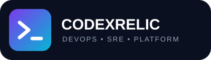
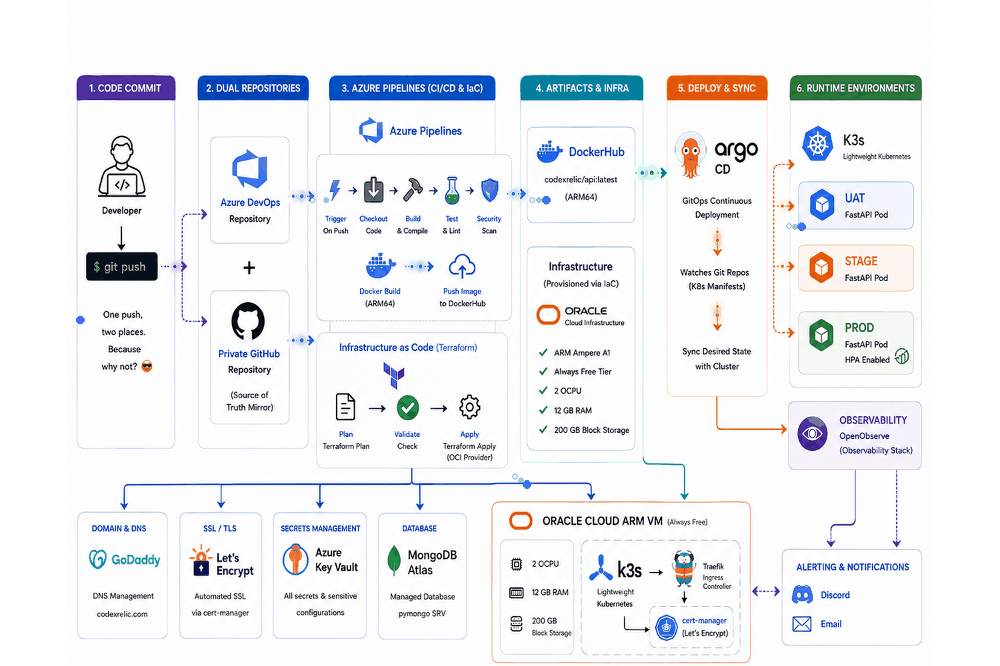

<div align="center">



# Free End-to-End DevOps Project

### A real production-style SRE playground — built on a $0 budget.

<p>
  <a href="https://codexrelic.com"><strong>🌐 Live Site</strong></a>
  ·
  <a href="https://stage.codexrelic.com">Staging</a>
  ·
  <a href="https://uat.codexrelic.com">UAT</a>
</p>

<p>
  
  
    
  
  
</p>

<p>
  
  
  
  
</p>

</div>

---

## ⚡ What is CodexRelic?

**CodexRelic is my end-to-end DevOps & SRE portfolio project.**

The goal is simple:

> **Build something that looks and behaves like a real production platform — without paying for a personal cloud lab.**

Why free?

**Because I am broke and don't have money to burn on personal projects like other professionals. Just keeping it real!** 😄

Beyond the code, I'm a real human who loves tech as much as watching movies, history, and philosophy.

Everything is intentionally wired together: infrastructure, Kubernetes, CI/CD, GitOps, secrets, security, observability, DNS, TLS, databases, environments and application delivery.

It is not a collection of disconnected demos.

**It is one living system.**

---

## 🧭 The Stack at a Glance

| Layer | Technology |
|---|---|
| ☁️ Compute | Oracle Cloud Always Free — Ampere ARM |
| ☸️ Kubernetes | K3s + HPA |
| 🚦 Ingress | Traefik |
| 🔐 TLS | cert-manager + Let's Encrypt |
| 🚀 CI/CD | Azure DevOps Pipelines |
| 🐳 Containers | Docker + QEMU |
| 📦 Registry | DockerHub |
| 🗄️ Database | MongoDB Atlas M0 |
| 🔑 Secrets | Azure Key Vault |
| 📊 Observability | OpenObserve |
| 🌍 DNS | GoDaddy |
| 🏗️ IaC | Terraform |
| 🐍 Backend | Python 3.11 + FastAPI + Uvicorn |
| 🔒 Auth | Ed25519 + bcrypt + JWT |
| 🎨 Frontend | Vanilla HTML / CSS / JavaScript |

---

## 🏗️ End-to-End Architecture

One `git push` kicks off the complete delivery chain: the code is sent to **Azure DevOps and the private GitHub repository**, Azure Pipelines handles **CI/CD + Infrastructure as Code**, DockerHub stores the ARM64 image, Terraform provisions the Oracle Cloud infrastructure, and Kubernetes manages the application state.

<p align="center">
  
</p>

> **This is the actual platform flow — not a generic DevOps reference architecture.**

## 🏗️ Architecture

```text
                         ┌──────────────────────┐
                         │       GoDaddy        │
                         │     DNS Management   │
                         └──────────┬───────────┘
                                    │
                                    ▼
                  ┌────────────────────────────────┐
                  │      Oracle Cloud ARM VM        │
                  │       Always Free Tier          │
                  │         2 OCPU · 12 GB          │
                  │                                │
                  │              K3s               │
                  │        Kubernetes Cluster      │
                  │                                │
                  │   ┌─────────────────────────┐  │
                  │   │        Traefik          │  │
                  │   │      Ingress/TLS        │  │
                  │   └────────────┬────────────┘  │
                  │                │               │
                  │    ┌───────────┼───────────┐   │
                  │    │           │           │   │
                  │   UAT        STAGE        PROD  │
                  │    │           │           │   │
                  │ FastAPI      FastAPI     FastAPI│
                  │                          + HPA  │
                  │                                │
                  │        Observability            │
                  │          OpenObserve             │
                  └───────────────┬────────────────┘
                                  │
                                  │ pymongo SRV
                                  ▼
                       ┌──────────────────────┐
                       │    MongoDB Atlas     │
                       │      M0 Free         │
                       │                      │
                       │  UAT · STAGE · PROD  │
                       └──────────────────────┘


        ┌───────────────────┐
        │   Azure DevOps    │
        │ Build → Scan →    │
        │ Deploy            │
        └─────────┬─────────┘
                  │
                  ▼
        ┌───────────────────┐
        │   Azure Key Vault │
        │      Secrets      │
        └───────────────────┘
```

---

## 🚀 What This Project Demonstrates

### 🧩 Modular Component Architecture

The backend is built as a highly scalable **Component-Based FastAPI Architecture**. 
Rather than a single monolithic file, the server is structured into clean components:
- **Core Engine**: Isolated modules for Database resilience, Logging, JWT Security, and Object Storage.
- **API Routers**: Endpoints are split by context (`admin.py`, `news.py`, `public.py`, `telemetry.py`), making adding new features simple.
- **Background Tasks**: Independent `asyncio` loops (like the Daily Tech News fetcher) run securely in the background.

The main `server.py` is an incredibly thin entrypoint that simply mounts these modular routes and middlewares.

---

### 🔄 GitOps Delivery


Azure Pipelines is responsible for the CI/CD workflow and infrastructure deployment. 

Because I work full-time, I don't have the energy to manually run:

```bash
kubectl apply
```

at 2 AM while half-asleep.

**Necessity is the mother of invention!**

Push code, go to bed, and let the machines do the heavy lifting while I dream. 😴

**Git is the source of truth. Azure Pipelines moves the change through the delivery process.**

---

### ☸️ Lightweight Kubernetes

The platform runs on **K3s**, deliberately chosen for a small ARM VM.

It provides:

- Kubernetes orchestration
- Environment isolation
- Production-style ingress
- Horizontal Pod Autoscaling in production
- Automated TLS
- Resource-efficient operation

---

### 🔐 Security by Design

I want to sleep good after work. If this gets hacked and starts mining crypto, my glorious **$0 budget** goes out the window. 😂

The project deliberately avoids putting secrets into source control or container images.

Security includes:

- Ed25519 WebCrypto challenge-response authentication
- bcrypt password protection
- Stateless JWT authentication
- Non-root containers
- Strict Content Security Policy headers
- Externalized secrets through Azure Key Vault
- Minimal Alpine-based container images

---

### 🐳 Container Hardening

The Docker images use:

- Multi-stage builds
- `alpine:3.20`
- Dedicated non-root `appuser`
- Python virtual environments
- Minimal runtime dependencies
- No embedded secrets

The objective is simple:

**Keep the image small. Keep the attack surface smaller.**

### 💥 OpenObserve Was Too Heavy

I initially tried deploying the full OpenObserve High-Availability Helm chart.

It crashed all the pods because it expected a much larger distributed database backend.

The solution?

Force:

```text
ZO_LOCAL_MODE=true
```

and use a lightweight embedded database.

**Sometimes the best scaling strategy is simply not deploying the thing you don't need.**

---

### 🛡️ Live Security Feed

The frontend features a sleek, dynamically themed **CVE Security News Ticker** that fetches the latest security vulnerabilities directly from an RSS feed (`cve.report`). 

Instead of just displaying raw feeds, the FastAPI backend applies a **heuristic severity scoring algorithm**. It parses the incoming CVE descriptions in real-time and sorts them based on high-severity keywords (like `RCE`, `buffer overflow`, and `privilege escalation`), ensuring the most critical vulnerabilities are immediately surfaced to the UI.

---

### 🖥️ Live VM Telemetry Widget

To showcase real-time data streaming and systems-level integration, the platform includes a **Live VM Stats Widget**. 

Built with an `htop`-inspired terminal aesthetic, this widget sits on the frontend and communicates with the backend via **WebSockets**. The FastAPI server utilizes `psutil` to asynchronously collect live hardware telemetry (CPU per core, Memory, Swap, Uptime, and Load Average) directly from the underlying Oracle ARM VM and streams it to the UI every 1.5 seconds without needing to refresh the page.

---

### 🧰 Sysadmin Tools: Certificate Decoder

As part of a growing suite of DevSecOps utilities, the platform features a **Certificate Decoder**.

This tool allows users to paste raw X.509 PEM certificates and instantly parse out vital details like the Subject, Issuer, Validity periods (with active countdowns), Serial Number, Signature Algorithm, and Subject Alternative Names (SANs).

**Privacy-First Architecture:** Rather than sending sensitive certificate data to the FastAPI backend for processing, the decoder is built using a **pure client-side architecture** leveraging `node-forge`. The certificate is parsed 100% locally in the browser, guaranteeing zero-trust privacy and zero network overhead.

---

### 📰 Daily Tech News Feed

The platform includes a self-sufficient **Daily Tech News** feature that aggregates the top 10 tech stories of the day.

Built using an `asyncio` background task inside the FastAPI server, the system automatically wakes up at midnight (UTC) to fetch and parse the Hacker News (YCombinator) RSS feed. The Top 10 articles are extracted and saved locally.

**Rolling 10-Day Archive:** To ensure the system remains entirely self-contained without bloating the database or storage, the application automatically moves the previous day's feed into an archive array and strictly enforces a 10-day retention limit, automatically purging older news.

---

## 🧪 Three Environments

| Environment | URL | Purpose |
|---|---|---|
| 🟢 **Production** | [codexrelic.com](https://codexrelic.com) | Live public site |
| 🟡 **Staging** | [stage.codexrelic.com](https://stage.codexrelic.com) | Pre-production smoke testing |
| 🔵 **UAT** | [uat.codexrelic.com](https://uat.codexrelic.com) | QA & acceptance testing |

Each environment has its own Kubernetes namespace and MongoDB database.

---

## 📊 Observability

SEO is a buzzword, but much like working in a large corporate organization — if you don't voice your opinion loudly in meetings, you don't exist.

If Google doesn't see my site, **does it even exist?** 😂

I had to yell at the search engine so I could be recognized.

### Observability

**OpenObserve** handles log and metric collection through Helm.

The important part is not simply installing an observability platform.

It is making one fit.

The original high-availability deployment was too heavy for the free ARM VM. The solution was to run OpenObserve in lightweight local mode using:

```text
ZO_LOCAL_MODE=true
```

Result:

**Useful observability without turning a free-tier VM into a space heater.**

---

## 🧠 The Engineering War Stories

This repository also documents the things that **went wrong**.

Because that's where the interesting engineering happens.

Production engineering isn't just about showing the architecture diagram when everything works.

It's also about the moment when Kubernetes tells you:

> **"No."**

and you figure out why.

### 📦 Kubernetes Annotation Limit

```text
Too long: may not be more than 262144 bytes
```

The deployment was changed to use:

```bash
kubectl apply --server-side
```

Sometimes production engineering is just finding the one flag that nobody told you about.

---

### 📊 OpenObserve Was Too Heavy

The initial HA Helm deployment overwhelmed the tiny free-tier environment.

Instead of throwing more hardware at it:

**the architecture was simplified.**

That is one of the central ideas behind this project:

> **Good engineering is not always about adding more infrastructure. Sometimes it is about removing it.**

---

## 🔐 Authentication Architecture

I refuse to maintain a massive database of passwords.

Back in my day, we had one password, and it was written on a sticky note under the keyboard. 😄

Now we use Ed25519 WebCrypto.

The admin authentication flow combines:

```text
Ed25519 WebCrypto
        +
bcrypt
        +
JWT
        ↓
Stateless Authentication
```

The application follows a **12-Factor style architecture**, keeping configuration externalized and application state out of the containers.

---

## 🌐 API

| Method | Endpoint | Auth | Purpose |
|---|---|---|---|
| `GET` | `/api/movies` | Public | List movies with SRE analogies |
| `GET` | `/api/blogs` | Public | List blog posts |
| `POST` | `/api/login` | — | Authenticate and issue JWT |
| `POST` | `/api/admin/movies` | JWT | Add movie |
| `POST` | `/api/admin/blogs` | JWT | Add blog post |
| `POST` | `/api/admin/resume` | JWT | Upload LaTeX resume |
| `GET` | `/admin/dashboard.html` | JWT | Protected admin dashboard |

---

## 🛡️ DevSecOps Pipeline

```text
                    Git Push
                       │
                       ▼
              ┌─────────────────┐
              │  Azure DevOps   │
              └────────┬────────┘
                       │
              ┌────────▼────────┐
              │      Build      │
              └────────┬────────┘
                       │
              ┌────────▼────────┐
              │   Security Scan │
              └────────┬────────┘
                       │
              ┌────────▼────────┐
              │ Docker + QEMU   │
              │   linux/arm64   │
              └────────┬────────┘
                       │
                       ▼
                  DockerHub
                       │
                       ▼
                       │
                       ▼
                 K3s Cluster
```

The pipeline also includes scheduled SSL-expiry monitoring.

---

## 💰 The $0 Infrastructure Challenge

The project deliberately uses free tiers wherever practical.

A massive shoutout to the heroes of the free-tier world: **Oracle Cloud,
, MongoDB and OpenObserve.**

Without you, this project would just be a local Docker container melting my laptop. 😂

And regarding the Oracle ARM VM:

> ARM processors are running everything today anyway, so deploying on Ampere isn't just taking free compute — **it's me being "visionary."** 😎

Here's the stack:

```text
Oracle Cloud        → Compute
MongoDB Atlas       → Database
Let's Encrypt       → TLS
             → GitOps
K3s                 → Kubernetes
OpenObserve         → Observability
Azure DevOps        → CI/CD
Azure Key Vault     → Secrets
```

The point isn't that enterprise infrastructure should always cost $0.

The point is:

> **You don't need a huge cloud bill to learn how enterprise infrastructure actually works.**

---

## 🤖 The AI Co-Pilot

Full disclosure:

A significant portion of the code was written with **Gemini via Antigravity**.

It was an interesting collaboration.

Sometimes the AI produced technically excellent solutions and diagnosed problems with impressive precision.

Other times it confidently invented complexity that nobody ordered.

My role was essentially:

```text
AI
 ↓
Generate
 ↓
Break something
 ↓
Human investigates
 ↓
Question assumptions
 ↓
Simplify
 ↓
Deploy
 ↓
Repeat
```

The important lesson wasn't **"AI wrote the code."**

It was learning how to **review, challenge, troubleshoot and productionize AI-generated code.**

---

## 🎯 Why I Built This

I wanted a project that demonstrates more than:

> "I know Docker."

Or:

> "I have worked with Kubernetes."

Instead, I wanted something where the pieces actually interact:

**Infrastructure → Application → CI/CD → GitOps → Kubernetes → Security → Secrets → Observability → Production**

This repository is my attempt to build that system from scratch.

And yes — I built it because I like this stuff.

I also don't have an enterprise cloud budget sitting around for personal experiments.

So I made the constraint part of the engineering challenge.

---

## 👨‍💻 About Me

### **Mohd Azam**

**Site Reliability Engineer · DevOps · Platform Engineering**

I enjoy experimenting with infrastructure, breaking things, figuring out why they broke, and then automating the fix.

If you're interested in DevOps, SRE, cloud infrastructure, Kubernetes or the engineering behind this project:

🌐 **[codexrelic.com](https://codexrelic.com)**  
💼 **[LinkedIn](https://linkedin.com/in/mohdazam193)**

---

<div align="center">

### Built with curiosity.  
### Debugged with persistence.  
### Deployed for $0.

**⭐ If you find this useful, consider giving the repository a star.**

</div>

---

## 📜 License

[Apache License 2.0](LICENSE)
